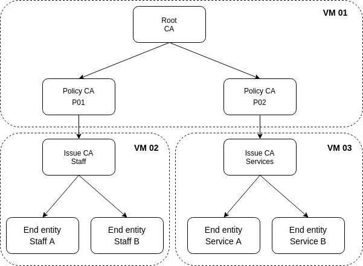
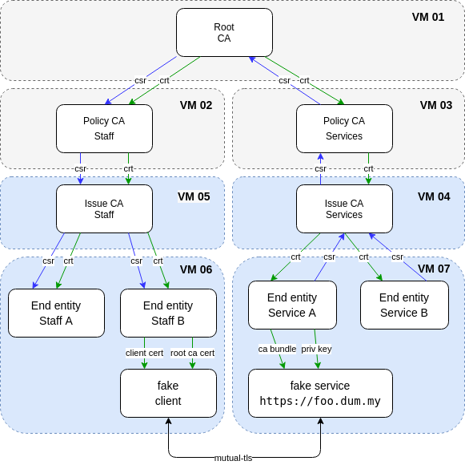

Ansible playbook as PKI with CA and RA
======================================

The concept
-----------

This is a example for ansible as CA in a PKI.

That is the CA tree, that is created by the Ansible-Playbook:

| As staging variation with 4 VMs | And as production variation with 8 VMs |
|---------------------------------|--------------------------------------|
|  |    |

The staging variation is in the inventory directory [*inventories/staging*](inventories/staging) and
the production variation is in the inventory directory [*inventories/production*](inventories/production)

That is the work flow of the certification:


First of all
------------

Has the variable *debug_output* in the file *group_vars/pki.yml* the value *true*, you get a lot of output.

Azure pre setup
---------------

The configuration of the Azure setup is in the file group_vars/azure_deploy.yml.
For creating VMs in Azure cloud, you can use the playbook setup_azure.yml. Enter:

```bash
ansible-playbook
  -i ./inventories/staging/hosts.yml \
  ./azure_bootstrap.yml
```

If your secrets encrypted than you can enter:

```bash
ansible-playbook  \
  --vault-password-file ~/.ssh/vault-password \
  -i ./inventories/staging/hosts.yml \
  ./azure_bootstrap.yml
```


For removing the azure setup enter:

```bash
ansible-playbook  \
  --vault-password-file ~/.ssh/vault-password \
  -i ./inventories/staging/hosts.yml \
  ./azure_destroy.yml
```

Run the main playbook
---------------------

*Preparation:* Edit the host_vars file and change the IPs of the
VMs (in group_vars/pki.yml). And maybe the ansible user in the file pki.yml in
the group_vars.

For gedding the IPs of the VMs from Azure enter:
To obtain the IPs of the VMs from Azure, enter:

```bash
az network public-ip list --output table
Name                           ResourceGroup    Location            Zones    Address         AddressVersion    AllocationMethod    IdleTimeoutInMinutes    ProvisioningState
-----------------------------  ---------------  ------------------  -------  --------------  ----------------  ------------------  ----------------------  -------------------
demo-pki-policy-ca-service-ip  demo-pki         germanywestcentral           20.52.35.205    IPv4              Dynamic             30                      Succeeded
demo-pki-root-ca-ip            demo-pki         germanywestcentral           51.116.185.237  IPv4              Dynamic             30                      Succeeded
```


For run this example enter:

```bash
export ANSIBLE_HOST_KEY_CHECKING=False && \
ansible-playbook \
-i ./inventories/staging/hosts.yml \
./pki_bootstrap.yml
```


Known issue
-----------

The playbook is switched off selinux. But for an effect,  ths need a restart
of the virtual machine.

Helpful tools
-------------

* [kleopatra](https://docs.kde.org/stable5/en/pim/kleopatra//)
* [Xca](https://hohnstaedt.de/xca/)
* [draw.io](https://www.draw.io/)

Helpful docs
------------

* [golinuxcloud.com](https://www.golinuxcloud.com/openssl-create-certificate-chain-linux/)

TODOs
-----

### Tasks

- "Write out database with 1 new entries \ Segmentation fault (core dumped)"
- For umbuntu:
```bashln -s /etc/nginx/conf.d/foo.dum.my.conf /etc/nginx/sites-enabled/foo.dum.my.conf
```
- Renaming group_vars and host_vars files


### Other interisting things

- [RabbitMQ](https://de.wikipedia.org/wiki/RabbitMQ)
- [PKI as JavaScript lib](https://github.com/PeculiarVentures/PKI.js)
- [Sharkey is a service for managing certificates for use by OpenSSH (Writen in Go)](https://github.com/square/sharkey)
-