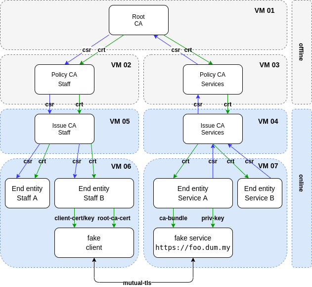

Ansible playbook as PKI with CA and RA
======================================

The concept
-----------

This is a example for ansible as CA in a PKI.

That is the CA tree, that is created by the Ansible-Playbook:

| As staging variation with 4 VMs | And as production variation with 7 VMs |
|---------------------------------|--------------------------------------|
|  |    |

The staging variation is in the inventory directory [*inventories/staging*](inventories/staging) and
the production variation is in the inventory directory [*inventories/production*](inventories/production)

That is the work flow of the certification:

|  |
|-----------------------------------------|

Certificate and csr will be exchange over http (nginx)

| |
|------------------------------------------------------------|

This is the proposal how the Ansible-PKI can be embedded in a sign certificates process.

|  |
|-------------------------------------------------------|


First of all
------------

Has the variable *debug_output* in the file *group_vars/pki.yml* the value *true*, you get a lot of output.


Checking git repo integrity
---------------------------

The Playbook ```git_check.yml``` is only a example for checking the integrity of the git code.

Azure pre setup (Azure cloud)
-----------------------------

The configuration of the Azure setup is in the file group_vars/azure_deploy.yml.
For creating VMs in Azure cloud, you can use the playbook setup_azure.yml. Enter:

```bash
ansible-playbook
  -i ./inventories/staging/hosts.yml \
  ./azure_bootstrap.yml
```

If your secrets encrypted than you can enter:

```bash
ansible-playbook  \
  --vault-password-file ~/.ssh/vault-password \
  -i ./inventories/staging/hosts.yml \
  ./azure_bootstrap.yml
```


For removing the azure setup enter:

```bash
ansible-playbook  \
  --vault-password-file ~/.ssh/vault-password \
  -i ./inventories/staging/hosts.yml \
  azure_destroy.yml
```

Undesanding inventory
---------------------

For the most of the inventory (directory) you find  only links between the
tiers. The goal is reduction the redundancies.

The differences are:

- *inventories/production/group_vars/pki.yml*
- *inventories/production/group_vars/pki_azure_deploy.yml*

```bash
$ diff ./inventories/staging/group_vars/pki.yml  ./inventories/production/group_vars/pki.yml

6,9c6,12
< vm_01:                      "51.116.225.106"
< vm_02:                      "51.116.114.242"
< vm_03:                      "51.116.114.249"
< vm_04:                      "51.116.115.5"
---
> vm_01:                      "20.52.41.243"
> vm_02:                      "20.52.41.152"
> vm_03:                      "20.52.41.88"
> vm_04:                      "20.52.41.223"
> vm_05:                      "51.116.186.241"
> vm_06:                      "51.116.187.148"
> vm_07:                      "20.52.41.92"
13,21c16,24
< policy_ca_staff_ip:         "{{ vm_01 }}"
< policy_ca_service_ip:       "{{ vm_01 }}"
< issue_ca_staff_ip:          "{{ vm_02 }}"
< issue_ca_service_ip:        "{{ vm_03 }}"
< foo_dum_my_ip:              "{{ vm_04 }}"
< bar_dum_my_ip:              "{{ vm_04 }}"
< baz_dum_my_ip:              "{{ vm_04 }}"
< jane_doe_ip:                "{{ vm_02 }}"
< john_doe_ip:                "{{ vm_02 }}"
---
> policy_ca_staff_ip:         "{{ vm_02 }}"
> policy_ca_service_ip:       "{{ vm_03 }}"
> issue_ca_staff_ip:          "{{ vm_04 }}"
> issue_ca_service_ip:        "{{ vm_05 }}"
> jane_doe_ip:                "{{ vm_06 }}"
> john_doe_ip:                "{{ vm_06 }}"
> foo_dum_my_ip:              "{{ vm_07 }}"
> bar_dum_my_ip:              "{{ vm_07 }}"
> baz_dum_my_ip:              "{{ vm_07 }}"
27d29

```

The differences is, that *production* use more VMs as staging.

Run the main playbook
---------------------

*Preparation:* Edit the host_vars file and change the IPs of the
VMs (in group_vars/pki.yml). And maybe the ansible user in the file pki.yml in
the group_vars.

For gedding the IPs of the VMs from Azure enter:
To obtain the IPs of the VMs from Azure, enter:

```bash
az network public-ip list --output table
Name                           ResourceGroup    Location            Zones    Address         AddressVersion    AllocationMethod    IdleTimeoutInMinutes    ProvisioningState
-----------------------------  ---------------  ------------------  -------  --------------  ----------------  ------------------  ----------------------  -------------------
demo-pki-policy-ca-service-ip  demo-pki         germanywestcentral           20.52.35.205    IPv4              Dynamic             30                      Succeeded
demo-pki-root-ca-ip            demo-pki         germanywestcentral           51.116.185.237  IPv4              Dynamic             30                      Succeeded
```


For run this example enter (this runs about 15 minutes):

```bash
export ANSIBLE_HOST_KEY_CHECKING=False && \
ansible-playbook \
-i ./inventories/staging/hosts.yml \
./pki_bootstrap.yml
```

Detailed documentation
----------------------

Here you can find a Detailed documentation in german and down load as...

* [eBook](docs/PKI-PoC-Concept_de.docx.epub)
* [MS Doc](docs/PKI-PoC-Concept_de.docx)
* [OpenDocument](docs/PKI-PoC-Concept_de.docx.odt)
* [PDF](docs/PKI-PoC-Concept_de.docx.pdf)
* [RTF](docs/PKI-PoC-Concept_de.docx.rtf)


Known issue
-----------

- The playbook is switched off selinux. But for an effect,  ths need a restart
of the virtual machine.
- Some times under Ubuntu: The step "TASK [pre_config : Upgrade all apt packages]" hangs up. Solution: Restart the playbook.
- Terraform print: ```resource with the ID "XXX" already exists - to be managed via Terraform this resource needs to be imported into the State.``` ***Solution:*** remove the .tmp directory.


Helpful tools
-------------

* [kleopatra](https://docs.kde.org/stable5/en/pim/kleopatra//)
* [Xca](https://hohnstaedt.de/xca/)
* [draw.io](https://www.draw.io/)

Helpful docs
------------

* [golinuxcloud.com](https://www.golinuxcloud.com/openssl-create-certificate-chain-linux/)
* [wikipedia.org to X.509](https://en.wikipedia.org/wiki/X.509)
* [openssl cookbook](https://www.feistyduck.com/library/openssl-cookbook/online/)
* [openssl man page](https://www.openssl.org/docs/manpages.html)

TODOs
-----

### Tasks

- Try playbook with OpenSUSE
- OpenSSL Issue: "Write out database with 1 new entries \ Segmentation fault (core dumped)"
- Adding a root CA offline mode to jump over the CAs thats a offline.

### Other interisting things

- [RabbitMQ](https://de.wikipedia.org/wiki/RabbitMQ)
- [PKI as JavaScript lib](https://github.com/PeculiarVentures/PKI.js)
- [Sharkey is a service for managing certificates for use by OpenSSH (Writen in Go)](https://github.com/square/sharkey)
