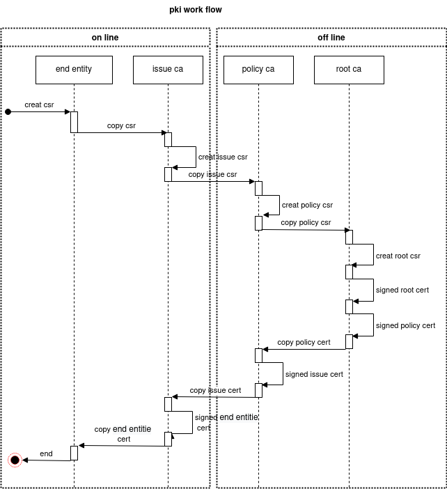

Ansible playbook as PKI with CA and RA
======================================

This is a example for ansible as CA in a PKI.

That is the CA tree, that is created by the Ansible-Playbook:


That is the work flow of the certification:



Run
---

*Preparation:* Edit the host_vars file and change the IPs of the VMs. And
maybe the ansible userin the file pki.yml in the group_vars.

For run this example enter:

```bash
ansible-playbook -i ./hosts.yml  ./site.yml
```

Helpful tools
----------------

* [kleopatra](https://docs.kde.org/stable5/en/pim/kleopatra//)
* [Xca](https://hohnstaedt.de/xca/)

TODOs
-----

### Check sign commits

* [gpg_whitelist](https://docs.ansible.com/ansible/latest/modules/git_module.html)
* [git-verify-commit](https://git-scm.com/docs/git-verify-commit)
* [git show  test-sign](https://developers.yubico.com/PGP/Git_signing.html)


Create key:

```bash
[or@augsburg02 play_pki_ca_with_ansible]$ gpg --default-new-key-algo rsa4096 --gen-key
gpg (GnuPG) 2.2.20; Copyright (C) 2020 Free Software Foundation, Inc.
This is free software: you are free to change and redistribute it.
There is NO WARRANTY, to the extent permitted by law.

Note: Use "gpg --full-generate-key" for a full featured key generation dialog.

GnuPG needs to construct a user ID to identify your key.

Real name: Olaf Radicke
Email address: Augsburg
Not a valid email address
Email address: briefksten@olaf-radicke.de
You selected this USER-ID:
    "jane doe <jane.doe@dum.my>"

Change (N)ame, (E)mail, or (O)kay/(Q)uit? o
We need to generate a lot of random bytes. It is a good idea to perform
some other action (type on the keyboard, move the mouse, utilize the
disks) during the prime generation; this gives the random number
generator a better chance to gain enough entropy.
gpg: key 5275AF235D317DFD marked as ultimately trusted
gpg: directory '/home/jd/.gnupg/openpgp-revocs.d' created
gpg: revocation certificate stored as '/home/jd/.gnupg/openpgp-revocs.d/35822C4A7868945A683DF7B75275AF235D317DFD.rev'
public and secret key created and signed.

Note that this key cannot be used for encryption.  You may want to use
the command "--edit-key" to generate a subkey for this purpose.
pub   rsa4096 2020-08-09 [SC] [expires: 2022-08-09]
      35822C4A7868945A683DF7B75275AF235D317DFD
uid                      jane doe <jane.doe@dum.my>

```

List kes:

```bash
[or@augsburg02 play_pki_ca_with_ansible]$ gpg --list-secret-keys --keyid-format LONG
/home/or/.gnupg/pubring.kbx
---------------------------
sec   rsa4096/5275AF235D317DFD 2020-08-09 [SC] [expires: 2022-08-09]
      35822C4A7868945A683DF7B75275AF235D317DFD
uid                 [ultimate] Olaf Radicke <briefksten@olaf-radicke.de>
```

Add key:

```bash
[or@augsburg02 play_pki_ca_with_ansible]$ git config user.signingkey 35822C4A7868945A683DF7B75275AF235D317DFD
```

Check tag sign:

```bash
[or@augsburg02 play_pki_ca_with_ansible]$ git verify-tag  test-sign
gpg: Signature made Sun 09 Aug 2020 10:37:09 AM CEST
gpg:                using RSA key 35822C4A7868945A683DF7B75275AF235D317DFD
gpg: Good signature from "Olaf Radicke <briefksten@olaf-radicke.de>" [ultimate]
```