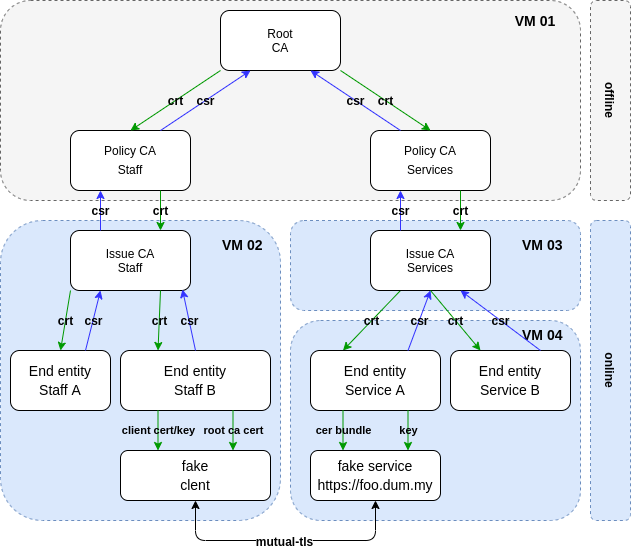

Ansible playbook as PKI with CA and RA
======================================

This is a example for ansible as CA in a PKI.

That is the CA tree, that is created by the Ansible-Playbook:



That is the work flow of the certification:


Azure pre setup
---------------

For creating VMs in Azure cloud, you can use the playbook setup_azure.yml. Enter:

```bash
ansible-playbook -i hosts.yml setup_azure.yml
```

If your secrets encryptet than you can enter:

```bash
ansible-playbook  \
  --vault-password-file ~/.ssh/vault-password \
  -i hosts.yml \
  ./setup_azure.yml
```

Get the public ips:

```bash
az network public-ip list
```

For removing the azure setup enter:

```bash
ansible-playbook  \
  --vault-password-file ~/.ssh/vault-password \
  -i hosts.yml \
  ./destroy_azure.yml
```

Run
---

*Preparation:* Edit the host_vars file and change the IPs of the VMs. And
maybe the ansible userin the file pki.yml in the group_vars.

For run this example enter:

```bash
ansible-playbook -i ./hosts.yml  ./site.yml
```


Known issue
-----------

The playbook is switched off selinux. But for an effect,  ths need a restart
of the virtual machine.

Helpful tools
-------------

* [kleopatra](https://docs.kde.org/stable5/en/pim/kleopatra//)
* [Xca](https://hohnstaedt.de/xca/)

Helpful docs
------------

* [](https://www.golinuxcloud.com/openssl-create-certificate-chain-linux/)

TODOs
-----

### Check sign commits

```yml
- name: Convert the format of the certificate to pem format
  shell: |
    openssl x509 \
    -in {{ pki_publication_dir }}/{{ root_ca.common_name }}.crt \
    -out {{ pki_publication_dir }}/{{ root_ca.common_name }}.crt.pem \
    -outform PEM
```